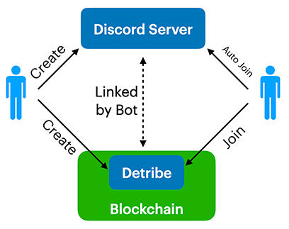
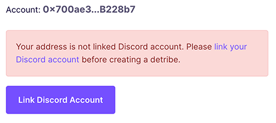
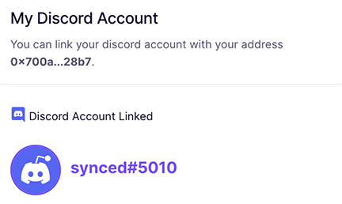
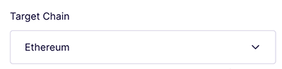
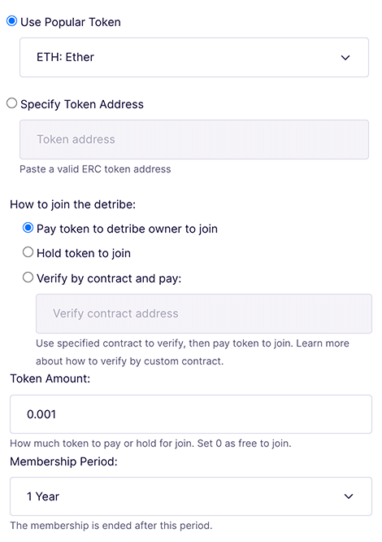
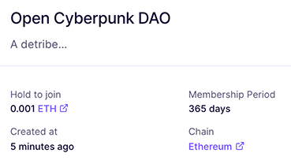
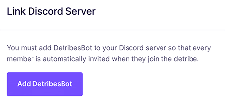
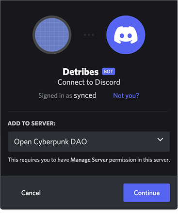
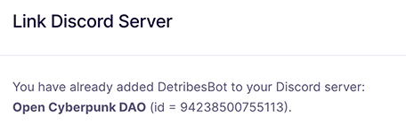
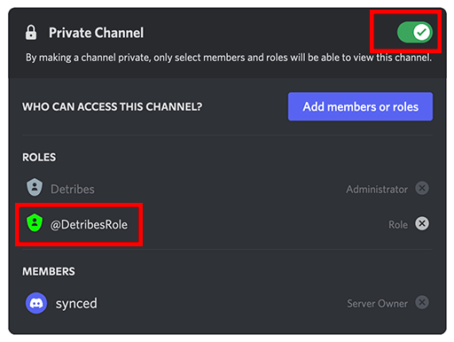

# User Guide

Anyone can create a Detribe on chain and link it to his/her Discord server. 
Others can join the Detribe and they will be joined the Discord server automatically 
by the Bot.

### Create Detribe

Before you create a new Detribe, make sure your account has been linked with your 
Discord user.

You can check the Discord user information after you linked your Discord user:

In the creation form you must select the chain that Detribe is created:

Detribes now support Ethereum, Polygon and BSC.

Then select the token for user paid or hold:

You can edit the detribe information after detribe was deployed on chain:

### Link to Discord Server

In Detribe detail page you can link your detribe to Discord server by click "Add DetribesBot":

Select your Discord server and add Detribes bot as Administrator:

You can find the Discord server information after the Bot was added to your Discord server:

Go to your Discord server and edit a target channel that you want to set as members only. 
Select "Permissions", set private channel on, and add `@DetribesRole` to ROLES:

This gives the Bot permission to invite qualified Detribe members to your Discord server automatically.
